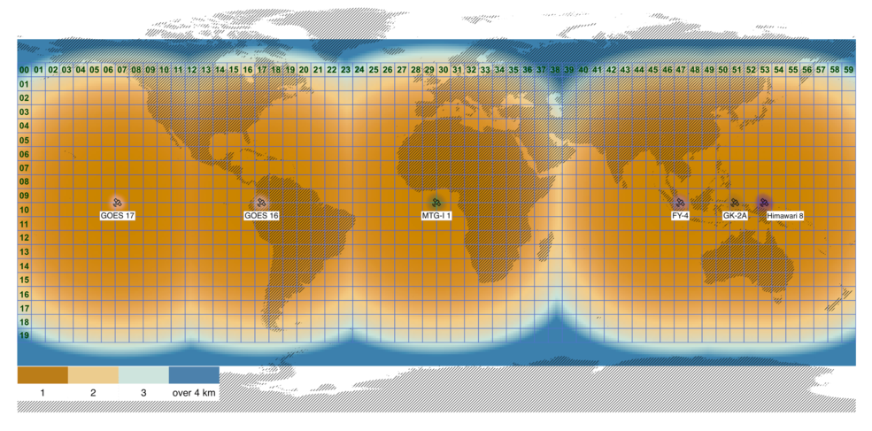

# Tutorial
>
>
> To run the animation code, you will need to modify the [configuration file](../nex/config/config.toml). The options below allow for custom animations. This animation process is available for GOES16-17 collections. The sensor will have to correspond to the proper satellite e.g. 'G16' for GOES-16. Due to the low overpass of these satellite the data retrieved is in 15 minute intervals. The following graphic illustrates the tiling system used:
>
> 
>
> <pre>
> [ANIMATE]
>    collection = '/nex/datapool/geonex/public/GOES17/GEONEX-L1G/'
>    sensor = 'G17'
>    tile = 'h09v03'
>    year = 2020
>    doys = [247, 248]
>    hours = [14, 24]
>    remove = true
></pre>